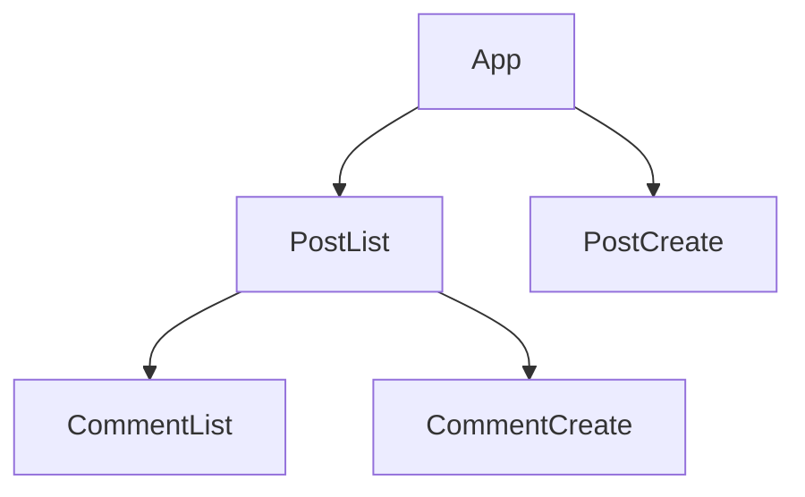
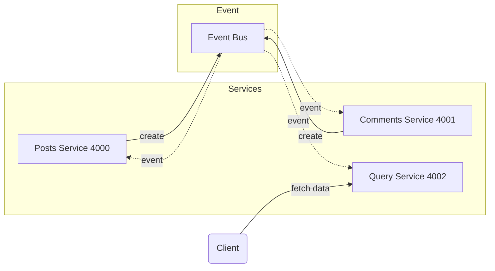
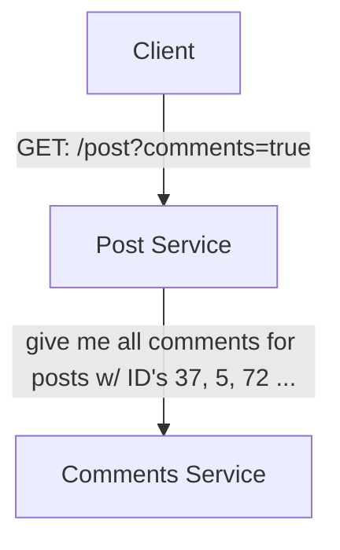
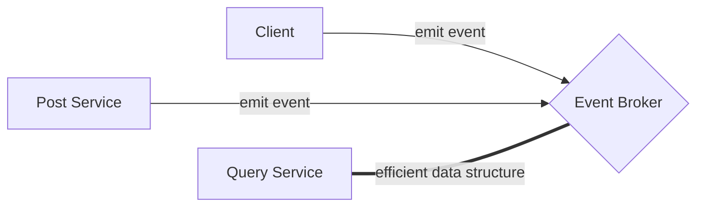

    Follow tutorial of Microservices with Node JS and React in Udemy.

    Just a taste of microservice. !! NOT FOR PRODUCTION !!

# Architechure
## Front-End components

## Back-End services 

# Notes

## Redundent http request if seperated services
From commits w/ message "Add component comment-list", you can see that every time client page rendered, it request posts services once, and comments 3 times.

Ref the RESTful logic:
- GET: /posts
- GET: /posts/:id/comments 

### Strategy 1: monolith app. 
Conbine posts service and comments servince into one mono service.

Change the RESTful logic:
- GET: /posts
- GET: /posts?comments=true

### Strategy 2: micorservices w/ Sync communication (BAD)

Cons:
- Introduce a dependency btw services
- If any inter-service request fails, the overall request fails
- The entire request is only as fast as the slowest request
- Can easily introduce webs of requests, which exagerate those 3 earlier problems

### Strategy 3: microservices w/ Async communication

Pros
- Query Service has zero dependencies on other services!
  - Meaning that event if others services is dead, your client react app works still!
- Query Service will be extremely fast!

Cons
- Data duplication
- Harder to understand
