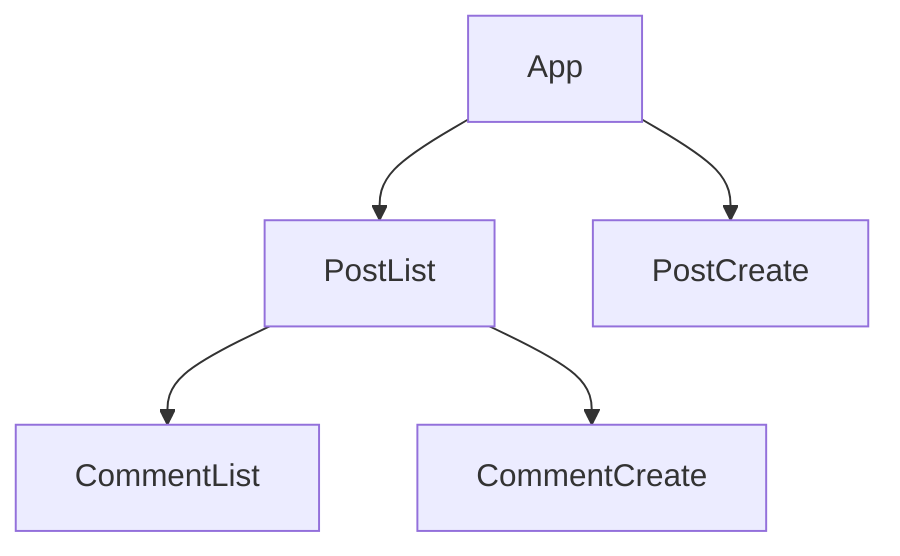
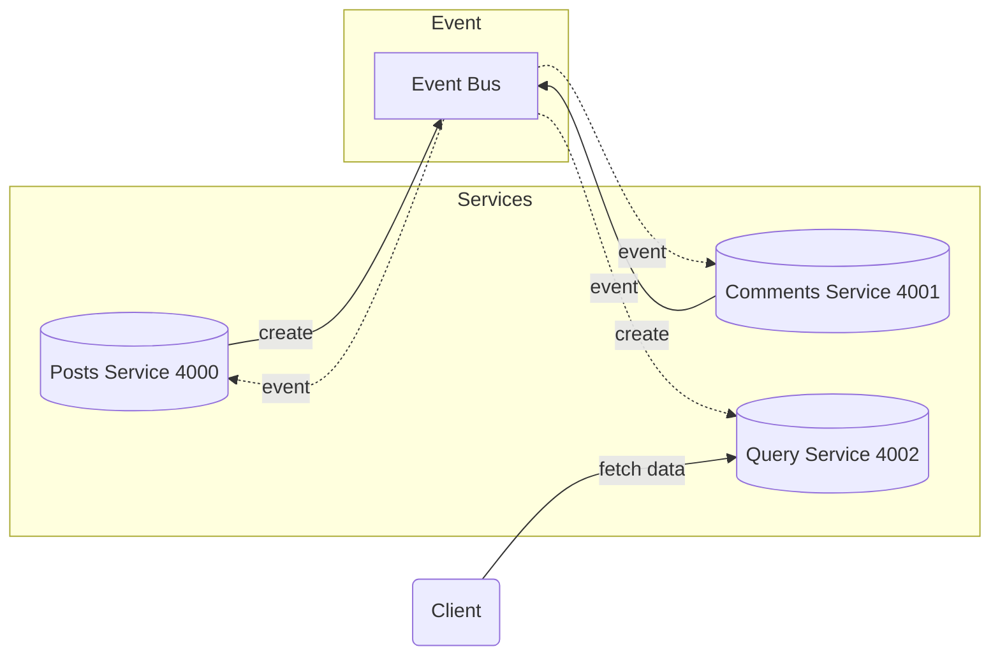
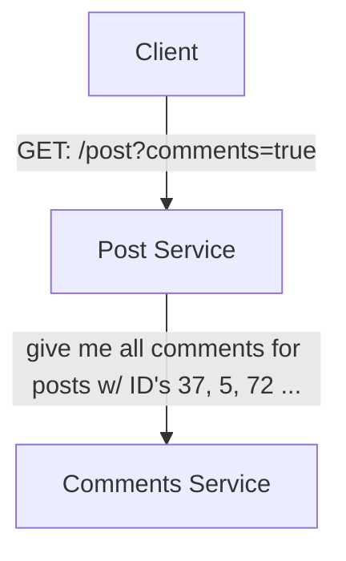
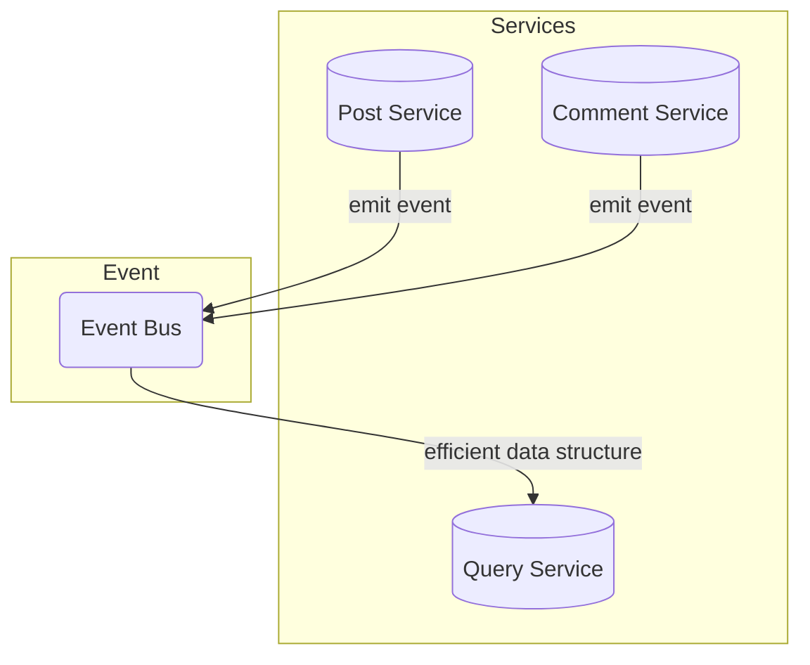

    Follow tutorial of Microservices with Node JS and React in Udemy.

    Just a taste of microservice. !! NOT FOR PRODUCTION !!

- [1. Architechure](#1-architechure)
  - [1.1. Front-End components](#11-front-end-components)
  - [1.2. Back-End services](#12-back-end-services)
- [2. Notes](#2-notes)
  - [2.1. Communicate Strategies](#21-communicate-strategies)
    - [2.1.1. monolith app.](#211-monolith-app)
    - [2.1.2. micorservices w/ Sync communication (BAD)](#212-micorservices-w-sync-communication-bad)
    - [2.1.3. microservices w/ Async communication](#213-microservices-w-async-communication)

# 1. Architechure
## 1.1. Front-End components

## 1.2. Back-End services 

# 2. Notes

## 2.1. Communicate Strategies
> Redundent http request if seperated services
> 
From this [commits](https://github.com/bstLearning/microservice-blog/commit/d57d1da547fa6e6ec0f9e1215c3b4764ed8d8f55) w/ message "Add component comment-list", you can see that every time client page rendered, it request posts services once, and comments 3 times. 

Ref the RESTful logic:
- GET: /posts
- GET: /posts/:id/comments 

### 2.1.1. monolith app. 
Conbine posts service and comments servince into one mono service.

Change the RESTful logic:
- GET: /posts
- GET: /posts?comments=true

### 2.1.2. micorservices w/ Sync communication (BAD)

Cons:
- Introduce a dependency btw services
- If any inter-service request fails, the overall request fails
- The entire request is only as fast as the slowest request
- Can easily introduce webs of requests, which exagerate those 3 earlier problems

### 2.1.3. microservices w/ Async communication

Pros
- Query Service has zero dependencies on other services!
  - Meaning that event if others services is dead, your client react app works still!
- Query Service will be extremely fast!

Cons
- Data duplication
- Harder to understand
